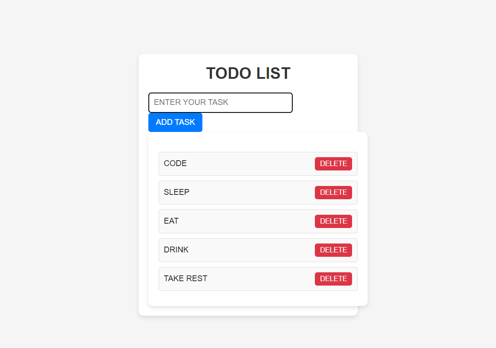

# TODO List Application

This is a simple TODO list application built using HTML, CSS, and JavaScript. The application allows you to add tasks to a list and delete tasks from the list.

## Features

- Add tasks to the list.
- Display tasks in uppercase.
- Delete tasks from the list.
- Responsive design for different screen sizes.

## Files

- `index.html`: The HTML file that contains the structure of the TODO list application.
- `style.css`: The CSS file that styles the TODO list application.
- `todo.js`: The JavaScript file that contains the functionality of the TODO list application.

## Setup

To set up and run this project locally, follow these steps:

1. Clone the repository or download the files.
2. Open the project folder in VS Code.
3. Open `index.html` in your preferred browser.

## Screenshot

## Contributing

Contributions are welcome! Here are a few ways you can contribute:

- Enhance the user interface.
- Add new features.
- Fix bugs and optimize code.